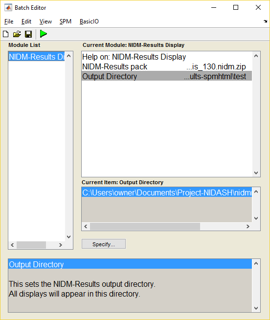
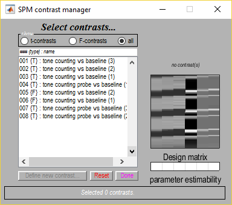

# nidmresults-spmhtml

Read and display NIDM-Results packs in the SPM environment.

##### Usage
To view NIDM results using the NIDM results viewer run the following

1. Open `SPM fMRI` from the Matlab command line.
1. Click on Batch.

  |
:-------------------------:
 **Fig. 1.** The SPM menu. |
3. Click on SPM -> Tools -> NIDM-Results Display

  |
:-------------------------:
 **Fig. 2.** The SPM option in the batch window. |
4. Enter the NIDM-Results file you wish to view and where you wish the output html to be stored. You can specify which contrasts to view here or the 'select' option can be chosen to open the contrast window.

 |  
:-------------------------:|
 **Fig. 3.** The NIDM-Results batch window. |
5. If the 'select' option was chosen and there are multiple contrasts stored inside the NIDM-Results pack, the contrast window will open. Select the contrasts you wish to view and click done. 

 |
:-------------------------:|
 **Fig. 4.** The contrast manager window. |
6. This should create output like the below.

            |  
:-------------------------:|:-------------------------:
 **Fig. 5.** Table data and images  |  **Fig. 6.** Summary statistics

##### Requirements

- [SPM12](http://www.fil.ion.ucl.ac.uk/spm/software/spm12/)

##### Installation

1. Add the filepath to SPM in Matlab;

 ```
 addpath(<full path to SPM>)
 ```
2. Clone this repository into the SPM toolboxes folder (into the below folder).
 ```
 <full path to SPM>/toolbox/
 ``` 

##### Testing

Currently, two versions of the test suite exist. One based on the `matlab unittesting framework` and the other based on the `[MOxUnit](https://github.com/MOxUnit/MOxUnit)` library. The `matlab unittesting framework` tests are recommended for testing the code locally in `Matlab` as they perform much faster and do not require any additional installation. The `MOxUnit` tests are recommended for testing the code locally in `Octave` and are also used for the Travis CI. Below is a description of how to run each test set.

#### Matlab Unittesting Framework

1. Add the filepath to the 'tests/matlabunit_testsuite' folder. In the Matlab commandline type;

 ```
addpath(fullfile(fileparts(which('nidm_results_display')), 'test', 'matlabunit_testsuite'))
 ```
2. Run runTest;

 ```
 runTest();
 ```
 
 #### MOxUnit Framework
 
 1. Download the MOxUnit testing framework to 'tests/moxunit_testsuite'. In the bash commandline type;
 
  ```
cd <PATH-TO-REPOSITORY>/tests/moxunit_testsuite
git clone https://github.com/MOxUnit/MOxUnit.git
  ```
 2. Download the test data from [NeuroVault](https://neurovault.org/). In the bash commandline type;

  ```
cd <PATH-TO-REPOSITORY>/tests/data
wget https://neurovault.org/collections/2210/download
unzip download
mv NIDM-Results\ 1.3.0\ examples\ -\ nidmfsl\ 1.2.01\ and\ SPM12\ r6906/* .
rm -r NIDM-Results\ 1.3.0\ examples\ -\ nidmfsl\ 1.2.01\ and\ SPM12\ r6906/
  ```
 3. From 'tests/moxunit_testsuite' run the MOxUnit tests. In the Octave/Matlab terminal type;

  ```
  moxunit_runtests
  ```
