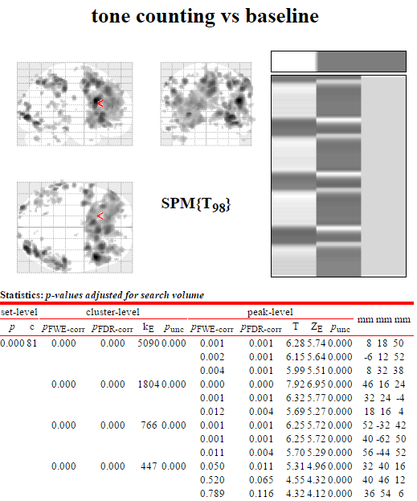
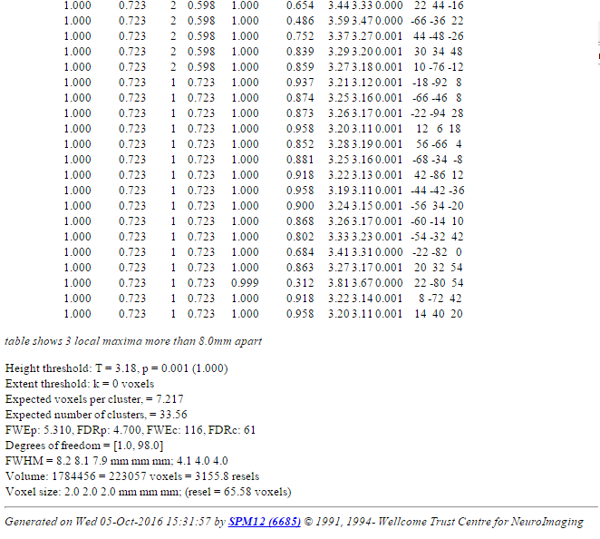

# nidmresults-spmhtml

Read and display NIDM-Results packs in the SPM environment.

##### Usage

To view NIDM results using the NIDM results viewer run the following:
 ```
 nidm_results_display(<full path to nidm json file you wish to view>)
 ```
(where `<full path to nidm json file you wish to view>` is replaced with the full path to the nidm json file you wish to view)

This should create output like the below.

            |  
:-------------------------:|:-------------------------:
 **Fig. 1.** Table data and images  |  **Fig. 2.** Summary statistics

##### Requirements

- [SPM12](http://www.fil.ion.ucl.ac.uk/spm/software/spm12/)

##### Installation

To run the NIDM-Results viewer do the following:

1. Add the filepath to the nidmresults-spmhtml directory in Matlab;

 ```
 addpath(<full path to nidmresults-spmhtml>)
 ```
1. Add the filepath to SPM in Matlab;

 ```
 addpath(<full path to SPM>)
 ```
 
##### Testing

Assuming the paths to the viewer have been added (see above), to run the tests do the following:

1. Add the filepath to the 'tests' folder;

 ```
addpath(fullfile((fileparts(which('nidm_results_display'))), 'test'))
 ```
1. Run runTest;

 ```
 runTest();
 ```
